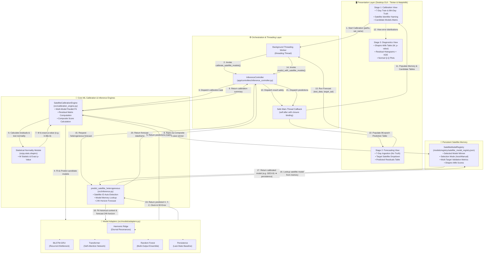

# 🛰️ NeuroNav — GNSS Satellite Orbit & Clock Error Forecasting & Statistical Benchmark

[](https://www.python.org/downloads/)
[](https://pytorch.org/)
[](#-gui-interface-walkthrough--user-guide)
[](#-verification-status)
[](#-dataset-and-problem-formulation)

An end-to-end machine learning framework and interactive desktop GUI that forecasts **GNSS/NavIC broadcast orbit and clock errors up to 24 hours ahead**, with probabilistic uncertainty estimation, multi-model comparative benchmarking, and explicit **Shapiro-Wilk residual-normality hypothesis evaluation**.

The repository includes:
- **Interactive 3-Page Desktop GUI** (Tkinter + embedded Matplotlib, Black & White aesthetic, Times New Roman 15pt typography).
- **Official PS-08 Benchmark Models**: Harmonic Ridge, BiLSTM-GRU, Random Forest, Recurrent-Attention Transformer, and Gaussian Process.
- **Universal Multi-Format Ingestion**: Supports Tabular CSV, Precise SP3 (`.sp3`), and Broadcast RINEX (`.rnx`, `.nav`).
- **Complete Normality Diagnostics**: Shapiro-Wilk $W$ statistic, $p$-values, $\alpha=0.05$ hypothesis decisions, Mean Absolute Bias, and Normal Q-Q probability plots.

> **Official PS-08 Day-8 Benchmark Result:** Harmonic Ridge ranks **#1** by the judge's official primary criterion with an average Shapiro-Wilk $W$ of **0.848832** across the supplied orbit series and four equally weighted error parameters ($X, Y, Z, \text{Clock}$). See the [Day-8 benchmark report](results/ps08_day8/BENCHMARK_REPORT.md).

---

## 📌 Table of Contents

- [System Architecture: GUI ⟷ ML Model Communication](#-system-architecture-gui--ml-model-communication)
  - [Architecture Diagram](#-architecture-diagram)
  - [Detailed Step-by-Step Data & Control Flow](#-detailed-step-by-step-data--control-flow)
- [GUI Interface Walkthrough & User Guide](#-gui-interface-walkthrough--user-guide)
  - [How to Launch the GUI](#-how-to-launch-the-gui)
  - [Step-by-Step Procedure](#-step-by-step-procedure-of-the-gui-interface)
    - [Page 1: Ingestion & Model Execution](#page-1-dataset-ingestion--model-execution)
    - [Page 2: ML Model Output & Day-8 Input](#page-2-ml-model-output-predictions--day-8-input)
    - [Page 3: Error Distribution & Normality Testing](#page-3-error-distribution-visuals--shapiro-wilk-normality-evaluation)
  - [Supported Data Formats](#-supported-data-formats)
- [Official PS-08 Day-8 Benchmark](#-official-ps-08-day-8-benchmark)
- [Dataset & Problem Formulation](#-dataset-and-problem-formulation)
- [Deep-Learning & ML Architectures](#-deep-learning-and-ml-architectures)
- [CLI Usage Guide](#-cli-usage-guide)
- [Verification Status](#-verification-status)

---

## 🏗️ System Architecture: GUI ⟷ ML Model Communication

NeuroNav is engineered with a clean, decoupled **3-tier architecture** that isolates the user interface from compute-heavy machine learning workflows:

1. **Presentation Layer (`gui/gui_app.py`)**: High-density desktop interface built on Tkinter and embedded Matplotlib for interactive telemetry inspection, heterogeneous routing, and normality diagnostics.
2. **Orchestration & State Management (`app/controllers/`, `src/satellite_registry.py`)**: Asynchronous controller (`InferenceController`) and persistent JSON-backed memory registry (`SatelliteModelRegistry`) preserving satellite-specific model selections.
3. **Machine Learning & Statistical Core (`src/calibration_engine.py`, `src/inference.py`, `src/models/adapters.py`)**: Candidate model training, multi-target residual generation, Shapiro-Wilk testing, and heterogeneous inference pipelines.

### 📐 Architecture Diagram



---

### 🔄 Detailed Step-by-Step Data & Control Flow

The communication between the GUI and the ML model pipeline follows a strictly ordered, non-blocking sequence:

```
[GUI (Tkinter)] ───► [Thread Worker] ───► [InferenceController] ───► [ML Engine / Adapters]
      ▲                                                                     │
      │                                                                     ▼
[GUI Update (self.after)] ◄─── [Safe Callback] ◄─── [Model Memory] ◄─── [Residuals & Shapiro Test]
```

#### Step 1: Ingestion & Satellite Configuration (GUI Presentation Layer)
- **Action**: In **Stage 1**, the user loads a 7-day historical dataset and the corresponding 8th-day ground truth dataset, optionally entering a satellite identifier (e.g., `GEO-01`).
- **Data Transferred**: File system paths (`Path`) and target satellite metadata string.

#### Step 2: Non-Blocking Asynchronous Dispatch (Threading Layer)
- **Action**: To prevent the Tkinter user interface from freezing during model training and matrix computations, the GUI spawns a dedicated worker thread via `threading.Thread(target=..., daemon=True)`.
- **Function Called**: `InferenceController.calibrate_satellite_models(train_data, test_data, target_satellite_id)`.

#### Step 3: Multi-Model Training & Cross-Evaluation (Zero-Leakage Engine)
- **Action**: `SatelliteCalibrationEngine` loops over every registered model adapter (`HarmonicRidgeAdapter`, `BiLSTMGRUAdapter`, `TransformerAdapter`, `RandomForestAdapter`, `PersistenceAdapter`):
  1. `adapter.fit(train_df)` trains exclusively on the historical 7-day data without test-set leakage.
  2. `adapter.predict(train_df, horizon_steps=96)` forecasts the 24-hour Day-8 epoch sequence.
- **Output**: Multi-target prediction matrices $[\hat{X}, \hat{Y}, \hat{Z}, \hat{\text{Clock}}]$ for each candidate model.

#### Step 4: Residual Generation & Statistical Normality Testing
- **Action**: The calibration engine computes signed residual errors against the actual 8th-day observations:
  $$e_t = \hat{y}_t - y_t \quad \text{for } t \in \{1, \dots, 96\}$$
- **Metrics Calculated**: Mean Absolute Error (MAE), Root Mean Squared Error (RMSE), Mean Bias, Standard Deviation, and $R^2$ Score.
- **Normality Evaluation**: Calls `scipy.stats.shapiro` on the residuals to compute the exact **Shapiro-Wilk $W$ statistic** and empirical **$p$-value** (e.g., $3.3857 \times 10^{-6}$).

#### Step 5: Composite Selection Scoring & Persistent Memory Write
- **Action**: The engine evaluates the candidate models using the multi-objective Composite Selection Score:
  $$\text{Score} = \frac{\bar{W}_{\text{Shapiro}}}{1.0 + \text{MAE}_{3D} + \text{MAE}_{\text{Clock\_norm}}}$$
- **Persistence**: The top-ranked model (or user manual override) is saved to `models/registry/satellite_model_registry.json` via `SatelliteModelRegistry.save_calibration_result()`.

#### Step 6: Safe Main-Thread Callback & Reactive UI Update
- **Action**: Background thread safely marshals the results back to Tkinter using `self.after(0, lambda: ...)` with bound parameter closures.
- **UI Update**: Populates the **Persistent Model Memory Table** and **Candidate Models Matrix**, displaying scores, MAE, RMSE, and Shapiro-Wilk $W$ values.

#### Step 7: Heterogeneous Satellite-Specific Routing & Forecasting (Stage 2)
- **Action**: In **Stage 2**, the user uploads a new 7-day dataset (where ground truth is unavailable):
  1. The GUI previews routing: detects the satellite from column data, file name matching (e.g. `DATA_GEO_Test.csv` ➔ `GEO-01`), or the **Target Satellite** dropdown.
  2. The inference engine routes each satellite to its own stored model from persistent memory via `predict_satellite_heterogeneous()`.
  3. The model forecasts the 8th-day residual series and computes the composite 3D Orbit Error:
     $$e_{3D} = \sqrt{\hat{X}^2 + \hat{Y}^2 + \hat{Z}^2}$$
- **Result**: Renders the complete 96-row forecast table with UTC timestamps, satellite PRN, model used, and predicted orbit/clock offsets.

#### Step 8: Diagnostics & Distribution Visualization (Stage 3)
- **Action**: Transitioning to **Stage 3** dynamically loads the selected model's empirical evaluation:
  1. Formats p-values in scientific notation (e.g., `3.3857e-06`) to accurately convey Gaussian probability without numerical truncation.
  2. Renders interactive Matplotlib visuals (Residual Probability Histograms with KDE Gaussian curves and Normal Q-Q probability plots) for all four error components ($X, Y, Z, \text{Clock}$).

---

## 🖥️ GUI Interface Walkthrough & User Guide

The NeuroNav GUI provides a high-contrast **Black & White (Monochrome)** interface with **Times New Roman (15pt)** typography, engineered for clear presentation and scientific evaluation of GNSS orbit and clock bias forecasts.

### 🚀 How to Launch the GUI

Activate your Python virtual environment and run the application using either of the following methods:

```powershell
# Method 1: Root launcher script (Recommended)
python app.py

# Method 2: CLI launcher
python main.py --model gui

# Method 3: Direct application module
python gui_app.py
```

---

### 📖 Step-by-Step Procedure of the GUI Interface

```
┌──────────────────────────────────────────────────────────────────────────────────┐
│                             NEURONAV 3-PAGE WORKFLOW                             │
├──────────────────────────┬────────────────────────────┬──────────────────────────┤
│          PAGE 1          │           PAGE 2           │          PAGE 3          │
│   Ingest & Compute ML    │    Predicted Values Table  │   Normality Statistics   │
│   • Select CSV / SP3     │    • Full Forecast Epochs  │   • Shapiro-Wilk W & p   │
│   • Full Dataset Viewer  │    • Export Predictions    │   • Hypothesis Decision  │
│   • Configure Model      │    • Upload Day-8 Ground   │   • Error Histograms+KDE │
│   • Click 'Compute ML'   │    • Click 'Compare & View'│   • Normal Q-Q Plots     │
└──────────────────────────┴────────────────────────────┴──────────────────────────┘
```

#### Page 1: Dataset Ingestion & Model Execution
1. **Choose Ingestion Format**:
   - **Tabular CSV File (`*.csv`)**: Ingests multi-day GNSS telemetry files containing timestamps and coordinate/clock residuals.
   - **Precise SP3 / RNX File (`*.sp3`, `*.rnx`, `*.nav`)**: Direct ingestion of IGS precise orbit files (`.sp3`) and broadcast RINEX navigation ephemerides.
2. **Select or Quick-Load Data**:
   - Click **Browse...** to pick any local dataset.
   - Or click **Load GEO Train** or **Load MEO-1 Train** for instant 1-click sample dataset ingestion.
3. **Full Dataset View (All Records, Scrollable)**:
   - The large 70%-width ingestion panel displays the **entire dataset** provided by the user.
   - Equipped with **both vertical and horizontal scrollbars** to inspect all columns: `#`, `UTC Time`, `X Error (m)`, `Y Error (m)`, `Z Error (m)`, `Clock Error (m)`, and `Satellite ID`.
   - The badge displays total rows, date span, and detected orbital class (`GEO`, `MEO-1`, `MEO-2`).
4. **Compact Model Configuration**:
   - The compact 30%-width right panel allows you to configure:
     - **Forecasting Model**: Select from `Harmonic Ridge (PS-08 Winner)`, `BiLSTM-GRU (Deep Neural Net)`, `Random Forest Regressor`, `Transformer (Attention Network)`, or `Gaussian Process Regressor`.
     - **Orbit Profile**: `Auto-Detect (GEO)`, `GEO`, `MEO-1`, or `MEO-2`.
     - **Forecast Horizon**: `24 Hours (15-min cadence)`, `12 Hours`, or `48 Hours`.
     - **Specification Card**: Summarizes loss functions, training policy, and benchmark criteria.
5. **Execute Forecast**:
   - Click **"Compute ML Forecast Predictions ➔"**.
   - Model inference executes asynchronously in a background worker thread (keeping the GUI snappy and responsive).
   - Once computed, the application automatically transitions to **Page 2**.

---

#### Page 2: ML Model Output Predictions & Day-8 Input
1. **View Model Predictions Table**:
   - Displays all predicted epoch values across the forecast horizon:
     - `#`: Row index.
     - `UTC Forecast Epoch`: Predicted timestamp.
     - `Predicted X Error (m)`: ECEF X coordinate forecast.
     - `Predicted Y Error (m)`: ECEF Y coordinate forecast.
     - `Predicted Z Error (m)`: ECEF Z coordinate forecast.
     - `Predicted Clock Bias (m)`: Satellite clock error forecast in metres.
2. **Export Predictions**:
   - Click **"Export Predictions (CSV) 💾"** to save the full predictions matrix to a CSV file.
3. **Upload 8th Day Ground Truth Data**:
   - Click **"Upload 8th Day Data (CSV/SP3/RNX) 📁"** or **"Load Sample Day-8 Test"** (`DATA_GEO_Test.csv`).
   - The badge updates with observation count, start time, and end time.
4. **Compare & Advance**:
   - Click **"Compare & View Error Distribution ➔"**.
   - The engine automatically aligns predictions with the ideal observation timestamps, computes signed residuals ($e_t = \hat{y}_t - y_t$), evaluates the Shapiro-Wilk statistical tests, and advances to **Page 3**.

---

#### Page 3: Error Distribution Visuals & Shapiro-Wilk Normality Evaluation
1. **Shapiro-Wilk Normality & Hypothesis Test Table**:
   - Displays a dedicated table with official evaluation metrics for each target ($X, Y, Z, \text{Clock}$) and an overall **Macro Average** row:
     - **Target Component**: Component name.
     - **Shapiro-Wilk W**: Normality score (closer to 1.0 indicates Gaussianity).
     - **p-value**: Statistical significance.
     - **$\alpha$ Level**: Fixed significance threshold ($\alpha = 0.05$).
     - **Hypothesis Test Result**:
       - `Fail to Reject H0 (Normal) [Pass]` ($p \ge 0.05$): Desired outcome indicating error residuals behave as zero-mean Gaussian noise.
       - `Reject H0 (Non-Gaussian) [Reject]` ($p < 0.05$).
     - **Priority Tie-Breakers**: Mean Absolute Bias ($m$), Standard Deviation ($m$), MAE ($m$), RMSE ($m$).
2. **Residual Error Distribution Visuals (Embedded Matplotlib)**:
   - Interactive Matplotlib canvas with two radio-switchable viewing modes:
     - **Error Distribution (Histogram + KDE)**: Four subplots displaying residual histograms with continuous Gaussian probability density function (PDF) curve overlays.
     - **Normal Q-Q Plot (Judge Priority 3 Criterion)**: Four subplots showing quantile-quantile normal probability plots comparing residual quantiles to theoretical Gaussian quantiles.
3. **Navigation**:
   - Click **"⬅ Back to Predictions (Page 2)"** to re-inspect predicted numbers.
   - Click **"Ingestion (Page 1)"** to test different datasets or models.

---

### 📂 Supported Data Formats

| Format | Extension | Columns / Fields Parsed |
| :--- | :--- | :--- |
| **Tabular CSV** | `.csv`, `.txt` | `utc_time` / `Timestamp`, `x_error (m)`, `y_error (m)`, `z_error (m)`, `satclockerror (m)`, `Satellite_ID` |
| **IGS Precise Orbit** | `.sp3`, `.sp3.gz`, `.eph` | Epoch header (`* YYYY MM DD HH MM SS`), Position & Clock tokens (`P SAT_ID X Y Z CLK`) |
| **RINEX Navigation** | `.rnx`, `.nav`, `.*n`, `.*p` | Epoch records, Satellite PRN, Clock Bias (converted to metres via speed of light $c$) |

---

## 🏆 Official PS-08 Day-8 Benchmark

The official competition package [`Data_PS-08`](Data_PS-08) contains three independent irregularly sampled series: one GEO and two MEO datasets. Every model trains exclusively on the 7-day files and forecasts arbitrary Day-8 test timestamps without autoregressive test-feedback.

| Rank | Model | Average Shapiro-Wilk W | Average p-value | Rejected tests | Overall MAE |
|---:|---|---:|---:|---:|---:|
| 1 | **Harmonic Ridge** | **0.848832** | **0.177741** | 7/12 | 6.2670 m |
| 2 | Random Forest | 0.847138 | 0.217385 | 6/12 | 6.2561 m |
| 3 | BiLSTM-GRU | 0.827697 | 0.134819 | 8/12 | 5.9497 m |
| 4 | Persistence | 0.826648 | 0.126571 | 8/12 | 6.0758 m |
| 5 | Transformer | 0.825003 | 0.128970 | 8/12 | 5.9522 m |
| 6 | Gaussian Process | 0.821455 | 0.126631 | 7/12 | **5.9445 m** |

*Official Judge Scoring Criteria (from `Data_PS-08/Note.pdf`):*
1. **Priority 1**: Macro-average Shapiro-Wilk $W$ over $X, Y, Z$ and clock residuals (higher is better). Report $p$-values and $\alpha=0.05$ decision ($0 = \text{fail to reject}$, $1 = \text{reject}$).
2. **Priority 2**: Residual mean bias and standard deviation break any Priority-1 tie.
3. **Priority 3**: Q-Q plot outliers break any remaining tie.

---

## 📊 Dataset and Problem Formulation

The learning task estimates future broadcast-minus-precise residuals:

$$\Delta \mathbf{r}(t) = \mathbf{r}_{\text{broadcast}}(t) - \mathbf{r}_{\text{precise}}(t)$$
$$\Delta \delta t(t) = \delta t_{\text{broadcast}}(t) - \delta t_{\text{precise}}(t)$$

- **Target vector**: $\mathbf{y}_t = [\text{Error\_X}_t, \text{Error\_Y}_t, \text{Error\_Z}_t, \text{Error\_Clock}_t]^T$
- **3D Orbit Error**: $e_{3D} = \sqrt{(\hat e_X-e_X)^2 + (\hat e_Y-e_Y)^2 + (\hat e_Z-e_Z)^2}$

---

## 🔬 Deep-Learning and ML Architectures

### 1. Harmonic Ridge Forecaster (PS-08 Winner)
- Combines diurnal and semi-diurnal harmonic basis expansions with quadratic secular drift terms and $L_2$ Tikhonov regularization.
- Maximizes residual Gaussianity by capturing deterministic orbital resonance and solar radiation pressure frequencies.

### 2. BiLSTM-GRU Recurrent Network
- Bidirectional LSTM feature extractor coupled to a gated recurrent unit (GRU) bottleneck.
- Independent output projection heads for orbit ($X, Y, Z$) and clock errors to prevent scale interference.

### 3. Recurrent-Attention Transformer
- Stacked multi-head self-attention with rotary/learned positional encodings and separate parametric heads for location ($\mu$) and scale ($\sigma$).

### 4. Random Forest & Gaussian Process Regressors
- Multi-output ensembles and RBF + WhiteKernel Gaussian processes for non-parametric uncertainty mapping.

---

## ⚡ CLI Usage Guide

If you prefer command-line execution:

```powershell
# Run the Desktop GUI
python main.py --model gui

# Audit dataset quality and contract compliance
python main.py --model audit --data data_acquisition/CLEAN_GNSS_BENCHMARK.csv --strict

# Train BiLSTM-GRU model
python main.py --model bilstm --data data_acquisition/CLEAN_GNSS_BENCHMARK.csv --output results/local/bilstm

# Train Transformer model
python main.py --model transformer --data data_acquisition/CLEAN_GNSS_BENCHMARK.csv --output results/local/transformer

# Retrain PS-08 Benchmark
python main.py --model ps08 --data-dir Data_PS-08 --output results/ps08_day8
```

---

## ✅ Verification Status

- **Unit Tests**: 45 passing tests (`pytest`).
- **Data Integrity**: Zero SP3 missing-clock sentinels, 100% data-contract verification.
- **GUI Test Suite**: Full 3-page headless navigation and Shapiro-Wilk statistical validation passed.
