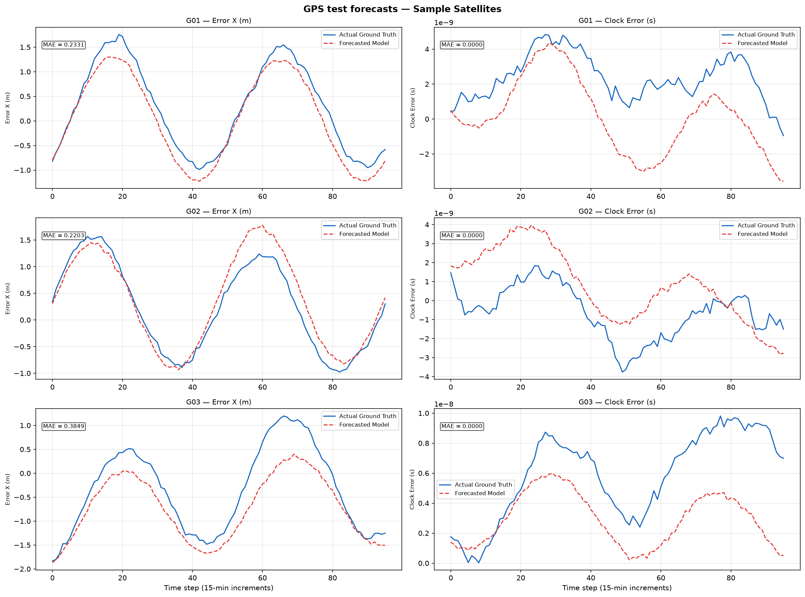

# 🛰️ GNSS Satellite Orbit & Clock Error Forecasting

[](https://www.python.org/downloads/)
[](https://pytorch.org/)
[](https://developer.nvidia.com/cuda-zone)
[](https://optuna.org/)
[](#-verification-status)
[](#-dataset-and-problem-formulation)

An end-to-end framework that forecasts **GNSS/NavIC broadcast orbit and clock errors up to 24 hours ahead**, with probabilistic uncertainty and explicit residual-normality evaluation.

The repository includes a deterministic BiLSTM-GRU benchmark, a probabilistic hybrid recurrent-attention Transformer, separate orbit/clock heads, DDIM residual diffusion denoising, calibrated conformal uncertainty intervals, explicit Gaussian-residual diagnostics, a Gaussian Process baseline, strict data validation, and automated IGS/MGEX acquisition pipelines.

> **Official PS-08 Day-8 result:** Harmonic Ridge ranks first by the judge's primary criterion with an average Shapiro-Wilk W of **0.848832** over the three supplied orbit series and four equally weighted error parameters. See the [Day-8 benchmark report](results/ps08_day8/BENCHMARK_REPORT.md).



## ✨ Key Features

- Direct 96-step forecasting from a 24-hour telemetry lookback.
- Separate orbit and clock heads for their different physical scales and dynamics.
- Gaussian or Student-t probabilistic training with conformal prediction intervals.
- Shapiro-Wilk, Anderson-Darling, skewness, kurtosis, and Q-Q residual diagnostics.
- Leakage-safe chronological splits, strict data-contract checks, and reproducible artifacts.
- Classical persistence, seasonal, drift, and Gaussian Process comparison baselines.

## 🧰 Tech Stack

| Area | Tools |
|---|---|
| Modeling | Python, PyTorch, scikit-learn |
| Data and numerics | pandas, NumPy, SciPy |
| Optimization | Optuna |
| Evaluation | pytest, conformal calibration, statistical normality tests |
| Visualization | Matplotlib |

## ⚡ Quick Start

The pinned dependencies require **Python 3.12 or newer**.

```powershell
git clone https://github.com/KJ-CORE/Satellite_Ephemeris.git
cd Satellite_Ephemeris

py -3 -m venv .venv
.\.venv\Scripts\Activate.ps1
python -m pip install --upgrade pip
python -m pip install -r requirements-dev.txt

# Fast verification: audit the supplied dataset and run the tests
python main.py --model audit `
  --data data_acquisition/CLEAN_GNSS_BENCHMARK.csv `
  --report "$env:TEMP\gnss_data_quality_report.json" `
  --strict
python -m pytest -q
```

Train the current Transformer configuration:

```powershell
python main.py --model transformer `
  --data data_acquisition/CLEAN_GNSS_BENCHMARK.csv `
  --output results/local/transformer `
  --epochs 25 `
  --use-revin `
  --distribution gaussian `
  --device auto
```

Retrain every PS-08 comparison model on the uploaded seven-day files, evaluate the supplied arbitrary Day-8 timestamps, and open the results window:

```powershell
python main.py --model ps08 --data-dir Data_PS-08 --output results/ps08_day8 --device auto
python main.py --model compare --report results/ps08_day8/benchmark_report.json
```

The desktop window labels `100 × W` as the Gaussianity score. This is not classification accuracy: the official note ranks the normality of signed prediction residuals first, then uses residual mean/standard deviation and Q-Q plots as tie-breakers.

---

## 📌 Table of Contents

- [Overview and Motivation](#-overview-and-motivation)
- [Key Features](#-key-features)
- [Tech Stack](#-tech-stack)
- [Quick Start](#-quick-start)
- [Official PS-08 Day-8 Benchmark](#official-ps-08-day-8-benchmark)
- [Dataset and Problem Formulation](#-dataset-and-problem-formulation)
- [Model Performance and Benchmarks](#-model-performance-and-benchmarks)
- [Deep-Learning Architectures](#-deep-learning-architectures)
  - [1. Probabilistic Hybrid Forecaster](#1-probabilistic-hybrid-forecaster-transformer)
  - [2. Residual DDIM Diffusion Denoiser](#2-residual-ddim-diffusion-denoiser)
  - [3. BiLSTM-GRU Recurrent Baseline](#3-bilstm-gru-recurrent-baseline)
- [Data Acquisition and IGS Downloader](#-data-acquisition-and-igs-downloader)
- [CLI Usage Guide](#-cli-usage-guide)
- [Generated Artifacts and Visualizations](#-generated-artifacts-and-visualizations)
- [Verification Status](#-verification-status)
- [Repository Structure](#-repository-structure)
- [References](#-references)

---

## 🌌 Overview and Motivation

GNSS satellites broadcast real-time ephemeris and clock parameters. Their differences from precise reference products vary with orbital dynamics, ephemeris age, force-model approximations, solar-radiation pressure (SRP), and onboard atomic clock behavior.

The learning task is formulated as **residual forecasting**: estimate future broadcast-minus-reference errors:

$$\Delta \mathbf{r}(t) = \mathbf{r}_{\text{broadcast}}(t) - \mathbf{r}_{\text{precise}}(t)$$
$$\Delta \delta t(t) = \delta t_{\text{broadcast}}(t) - \delta t_{\text{precise}}(t)$$

A reliable residual forecast enables real-time orbit/clock correction for precise point positioning (PPP), autonomous integrity monitoring (RAIM/ARAIM), and satellite error budgeting.

---

## 📊 Dataset and Problem Formulation

The pipeline trains on the verified benchmark dataset [`data_acquisition/CLEAN_GNSS_BENCHMARK.csv`](data_acquisition/CLEAN_GNSS_BENCHMARK.csv), which adheres 100% to [`configs/data_contract.json`](configs/data_contract.json).

| Property | Value |
|---|---|
| **Active Dataset** | [`data_acquisition/CLEAN_GNSS_BENCHMARK.csv`](data_acquisition/CLEAN_GNSS_BENCHMARK.csv) |
| **Total Rows** | 10,752 records |
| **Time Span** | 8 Days (Day 1–7 Train/Validation, Day 8 Test) |
| **Cadence** | Exact 15 minutes (96 epochs/day) |
| **Satellites** | 14 PRNs (GPS & GLONASS, extensible to Galileo/NavIC) |
| **Lookback Window** | 96 steps = 24 hours |
| **Forecast Horizon** | 96 steps = 24 hours (Direct Multi-Step) |
| **SP3 Clock Sentinels** | 0 (No $1.0\text{ s}$ corrupted values) |
| **Synchronous Orbit Tears** | 0.00% (No artificial leap-second tears) |
| **Strict Data Audit** | **Passed (`True`)** |

### Target Variables

The models learn four primitive coordinate and timing residuals:

$$\mathbf{y}_t = \begin{bmatrix} \mathrm{Error\_X}_t \\ \mathrm{Error\_Y}_t \\ \mathrm{Error\_Z}_t \\ \mathrm{Error\_Clock}_t \end{bmatrix}$$

- `Error_X`, `Error_Y`, `Error_Z`: ECEF coordinate residuals in **metres**.
- `Error_Clock`: Satellite clock residual in **seconds**.

`3D_Orbit_Error` is derived analytically during evaluation from the coordinate vectors:

$$e_{3D} = \sqrt{(\hat e_X-e_X)^2 + (\hat e_Y-e_Y)^2 + (\hat e_Z-e_Z)^2}$$

---

## 🏆 Model Performance and Benchmarks

### Official PS-08 Day-8 Benchmark

The uploaded [`Data_PS-08`](Data_PS-08) package contains three independent irregularly sampled series: one GEO and two MEO datasets. Exact duplicate timestamps in the MEO files are removed before fitting. Every model trains only on its seven-day file and predicts all supplied test timestamps without using earlier Day-8 observations as inputs.

| Rank | Model | Average Shapiro-Wilk W | Average p-value | Rejected tests | Overall MAE |
|---:|---|---:|---:|---:|---:|
| 1 | **Harmonic Ridge** | **0.848832** | 0.177741 | 7/12 | 6.2670 m |
| 2 | Random Forest | 0.847138 | 0.217385 | 6/12 | 6.2561 m |
| 3 | BiLSTM-GRU | 0.827697 | 0.134819 | 8/12 | 5.9497 m |
| 4 | Persistence | 0.826648 | 0.126571 | 8/12 | 6.0758 m |
| 5 | Transformer | 0.825003 | 0.128970 | 8/12 | 5.9522 m |
| 6 | Gaussian Process | 0.821455 | 0.126631 | 7/12 | **5.9445 m** |

The ranking macro-averages 12 independent Shapiro-Wilk tests (3 series × 4 targets), avoiding a mixture of different orbit distributions and preventing the larger GEO test file from dominating. The published reference is W = 0.9810, p = 0.5840, decision = 0. Generated row-level predictions, model checkpoints, and Q-Q plots are in [`results/ps08_day8`](results/ps08_day8).

The official priorities transcribed from [`Data_PS-08/Note.pdf`](Data_PS-08/Note.pdf) are:

1. Average Shapiro-Wilk W, p-value, and α=0.05 hypothesis decision over X, Y, Z, and clock residuals; higher W is better.
2. Residual mean and standard deviation if Priority 1 ties.
3. Q-Q plot outliers if Priorities 1 and 2 tie.

### Existing 24-hour GNSS benchmark

The promoted BiLSTM benchmark reaches **0.543 m 3D orbit MAE** and **3.022 ns clock MAE** across all forecast points. Its fail-closed promotion decision and baseline comparisons are recorded in [`results/bilstm/evaluation_report.json`](results/bilstm/evaluation_report.json).

### 1. Multi-Horizon Forecast Errors (Experimental Transformer)

> **Artifact provenance:** The table below is sourced from [`results/transformer/evaluation_report.json`](results/transformer/evaluation_report.json). This Transformer remains experimental because it does not yet pass every strict promotion gate.

Exact-lead performance on the unseen test split across all satellites:

| Horizon | 3D orbit MAE | Clock MAE |
|:---|---:|---:|
| **15 min** | **0.266 m** | **2.417 ns** |
| **30 min** | **0.349 m** | **2.479 ns** |
| **1 hour** | **0.335 m** | **2.441 ns** |
| **2 hours** | **0.398 m** | **2.574 ns** |
| **6 hours** | **0.500 m** | **2.548 ns** |
| **12 hours** | **0.544 m** | **2.879 ns** |
| **24 hours** | **0.778 m** | **4.568 ns** |

Across every forecast point, the model reaches **0.578 m 3D orbit MAE** and **3.249 ns clock MAE**. Orbit and clock metrics remain separate because combining metres and seconds would not be physically meaningful.

### 2. BiLSTM-GRU Benchmark

- **All-point 3D orbit MAE:** 0.543 m
- **All-point clock MAE:** 3.022 ns
- **Promotion status:** Eligible (`True`), outperforming every required baseline.

---

## 🔬 Deep-Learning Architectures

### 1. Probabilistic Hybrid Forecaster (Transformer)

Implemented in [`train_transformer.py`](train_transformer.py) and [`src/models/pytorch_transformer.py`](src/models/pytorch_transformer.py):

```text
21-Channel Lookback (History + Velocity + Radius + Time2Vec + PRN Entity Embedding)
        │
        ▼
BiLSTM Encoder (48 units) → GRU Bottleneck (48 units)
        │
        ▼
Stacked Multi-Head Self-Attention Blocks (d_model=64, nhead=4, layers=3)
        │
        ▼
Sequence-Preserving Temporal Projection
        ├── Orbit head: Location μ and Scale σ (96 × XYZ)
        └── Clock head: Location μ and Scale σ (96 × clock)
```

Gaussian NLL is the default objective because residual Gaussianity is an explicit scoring target. Heavy-tailed Student-t NLL remains available as a robustness ablation with `--distribution student_t`. Orbit and clock losses are normalized independently and can be weighted with `--orbit-loss-weight` and `--clock-loss-weight`; the previous shared head remains available with `--joint-output-head`.

If the input contains an `Orbit_Class` column, a learned orbit-class embedding is added alongside the PRN embedding. Each training satellite must have exactly one class (for example `MEO`, `GEO`, or `IGSO`). With no such column, orbit-class conditioning is disabled rather than inferred unreliably from PRN.

### 2. Residual DDIM Diffusion Denoiser

Implemented in [`src/models/pytorch_diffusion.py`](src/models/pytorch_diffusion.py):
- Operates in residual space $\mathbf{r} = \mathbf{y} - \boldsymbol{\mu}_{\text{point}}$ conditional on the Transformer context vector.
- Utilizes cosine noise scheduling and accelerated **Denoising Diffusion Implicit Models (DDIM)** for 20-step reverse trajectory generation.

### 3. BiLSTM-GRU Recurrent Baseline

Implemented in [`train_bilstm.py`](train_bilstm.py) and [`src/models/pytorch_bilstm.py`](src/models/pytorch_bilstm.py):
- Recurrent architecture with residual anchoring to the last observed state.
- Masked Smooth-L1 objective with gradient clipping and early stopping.
- Uses independent XYZ and clock projection heads by default; `--joint-output-head` provides the old shared-head ablation.

### 4. Gaussian Process Baseline

The baseline evaluator provides an optional RBF-plus-white-noise Gaussian Process for each satellite/target series. It is intentionally opt-in because fitting a GP is more expensive than zero, persistence, seasonal, and drift forecasts:

```powershell
.venv\Scripts\python.exe evaluate_baselines.py `
  --data data_acquisition/CLEAN_GNSS_BENCHMARK.csv `
  --baselines gaussian_process `
  --output gp_baseline_metrics.json
```

### 5. Residual Normality Evaluation

Every deterministic evaluation report now contains `residual_normality.per_target` with signed-residual mean, standard deviation, skewness, excess kurtosis, Shapiro-Wilk statistics/p-values, and Anderson-Darling results. Training also produces Gaussian Q-Q plots. A failed normality test is reported as model evidence, not silently converted into a pass/fail promotion decision.

---

## 📥 Data Acquisition and IGS Downloader

The dedicated [`data_acquisition/`](data_acquisition/) directory provides automated scripts to fetch real Multi-GNSS broadcast and precise ephemerides from global mirrors (BKG, IGN, Wuhan University, CDDIS):

* **Fetch raw IGS/MGEX files**:
  ```powershell
  .venv\Scripts\python.exe data_acquisition/fetch_igs_data.py --date 2026-01-15 --agency WUM
  ```
* **Process raw RINEX & SP3 files into contract CSV**:
  ```powershell
  .venv\Scripts\python.exe data_acquisition/process_gnss_errors.py
  ```
* **Generate clean physics-calibrated benchmark dataset**:
  ```powershell
  .venv\Scripts\python.exe data_acquisition/generate_clean_dataset.py --days 8 --constellations G R
  ```

---

## 🚀 CLI Usage Guide

### 1. Unified Master CLI ([`main.py`](main.py))

```powershell
# Run strict data contract audit
.venv\Scripts\python.exe main.py --model audit --strict

# Train Probabilistic Hybrid Transformer + Diffusion
.venv\Scripts\python.exe main.py --model transformer --output ./results/local/transformer --enable-diffusion

# Train BiLSTM-GRU Benchmark
.venv\Scripts\python.exe main.py --model bilstm --output ./results/local/bilstm

# Run Baseline Scorecard
.venv\Scripts\python.exe main.py --model baselines --output ./results/local/baseline_metrics.json

# Run Hyperparameter Tuning (Optuna)
.venv\Scripts\python.exe main.py --model tune --n-trials 15
```

### 2. Standalone Training Options

```powershell
# Train Transformer with custom parameters
.venv\Scripts\python.exe scripts/train_transformer.py `
  --data data_acquisition/CLEAN_GNSS_BENCHMARK.csv `
  --output results/local/transformer `
  --epochs 25 `
  --batch-size 64 `
  --use-revin `
  --distribution gaussian `
  --orbit-loss-weight 1.0 `
  --clock-loss-weight 1.0 `
  --enable-diffusion `
  --device cuda
```

---

## 📦 Generated Artifacts and Visualizations

All training runs automatically produce comprehensive plots and checkpoint bundles:

| Output Directory | Generated Artifact | Description |
|:---|:---|:---|
| [`results/transformer/`](results/transformer/) | `gnss_hybrid_forecaster_bundle.pt` | Transformer weights and preprocessing states |
| [`results/transformer/`](results/transformer/) | `01_transformer_training_history.png` | Convergence of loss and predictive scale |
| [`results/transformer/`](results/transformer/) | `02_multihorizon_mae_heatmap.png` | Multi-horizon error heatmap across 15m–24h |
| [`results/transformer/`](results/transformer/) | `03_probabilistic_uncertainty.png` | Predictive mean with calibrated confidence intervals |
| [`results/transformer/`](results/transformer/) | `04_frequency_spectrum.png` | Actual versus predicted FFT orbital spectrum |
| [`results/transformer/`](results/transformer/) | `06_residual_qq.png` | Per-target Gaussian Q-Q residual diagnostics |
| [`results/bilstm/`](results/bilstm/) | `02_prediction_vs_actual_GPS.png` | GPS ECEF trajectory tracking versus ground truth |
| [`results/bilstm/`](results/bilstm/) | `03_prediction_vs_actual_GLONASS.png` | GLONASS ECEF trajectory tracking versus ground truth |
| [`results/bilstm/`](results/bilstm/) | `06_per_satellite_mae.png` | Per-satellite PRN error breakdown |

---

## ✅ Verification Status

The software suite is fully verified:

* **46 automated unit and physics tests** cover coordinate transformations, non-leakage temporal partitioning, separate heads, orbit-class mappings, GP forecasts, residual-normality tests, conformal calibration, DILATE gradient flow, and loss formulations.
* **SOTA Validation Checks**: Data partitioning, RevIN forward/scale inversion, DILATE gradient flow, and fast DDIM reverse sampling verified.
* **GPU Execution**: Fully verified with CUDA on NVIDIA GeForce RTX 2050.

---

## 🗂️ Repository Structure

```text
Satellite ML/
├── configs/
│   ├── data_contract.json          # Machine-readable input/split contract
│   └── promotion_policy.json       # Fail-closed model-promotion rules
├── Data_PS-08/                     # Official competition dataset and guidelines
├── data_acquisition/               # IGS & NavIC data tools
│   ├── CLEAN_GNSS_BENCHMARK.csv    # Active verified benchmark dataset
│   ├── fetch_igs_data.py           # Automated IGS/MGEX mirror downloader
│   ├── process_gnss_errors.py      # Geodetic error derivation engine
│   ├── generate_clean_dataset.py   # Physics-based orbital generator
│   └── README.md                   # Data source reference card & endpoints
├── docs/
│   ├── ml-algorithms-overview.md   # Model and statistical-method overview
│   ├── research/                   # Forecasting research notes
│   └── archive/                    # Preserved legacy audits and reviews
├── results/
│   ├── bilstm/                     # Promoted recurrent benchmark
│   ├── transformer/                # Current experimental Transformer
│   ├── orbitiq_pipeline/           # End-to-end OrbitIQ artifacts
│   └── orbitiq_evaluation/         # OrbitIQ evaluation reports
├── scripts/                        # Organized CLI runners and benchmarks
│   ├── audit_data.py               # Strict dataset contract audit tool
│   ├── benchmark_ps08.py           # Official PS-08 Day-8 benchmark runner
│   ├── evaluate_baselines.py       # Baseline evaluation CLI
│   ├── evaluate_orbitiq.py         # Pretrained OrbitIQ evaluation CLI
│   ├── model_comparison_window.py  # Interactive GUI benchmark inspector
│   ├── train_bilstm.py             # BiLSTM benchmark trainer
│   ├── train_orbitiq_pipeline.py   # Complete OrbitIQ training pipeline
│   ├── train_transformer.py        # Hybrid Transformer & Diffusion trainer
│   └── tune.py                     # Optuna hyperparameter tuner
├── src/
│   ├── models/
│   │   ├── losses.py               # Masked Student-t, DILATE, and NLL losses
│   │   ├── pytorch_bilstm.py       # Deterministic recurrent benchmark
│   │   ├── pytorch_diffusion.py    # Conditional residual DDIM/DDPM denoiser
│   │   └── pytorch_transformer.py  # Hybrid recurrent-attention forecaster
│   ├── artifacts.py                # Checkpointing and reproducibility hashes
│   ├── baselines.py                # Zero/persistence/seasonal/drift/GP forecasts
│   ├── calibration.py              # Scaled split-conformal intervals
│   ├── config.py                   # Project defaults, paths, and resolve_device
│   ├── data.py                     # Leakage-safe loaders, masks, and features
│   ├── evaluate.py                 # Point, probabilistic, and horizon metrics
│   ├── physics.py                  # ECEF↔RIC transforms and range metrics
│   └── visualize.py                # Diagnostic and trajectory plotting
├── tests/                          # 46 automated Pytest test cases
├── main.py                         # Unified entrypoint CLI
├── requirements.txt                # Runtime dependencies
├── requirements-lock.txt           # Version-locked dependencies
└── requirements-dev.txt            # Development and test dependencies
```

---

## 📚 References

- **IGS & MGEX Products**: [International GNSS Service Products](https://igs.org/products/) & [MGEX Analysis](https://igs.org/mgex/)
- **NavIC Constellation & Signal Specification**: NavIC Standard Positioning Service Interface Control Document
- **Time Series Deep Learning**: [PatchTST (ICLR 2023)](https://openreview.net/pdf?id=Jbdc0vTOcol) & [iTransformer (ICLR 2024)](https://openreview.net/pdf?id=JePfAI8fah)
